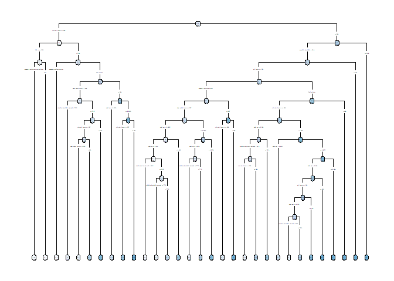
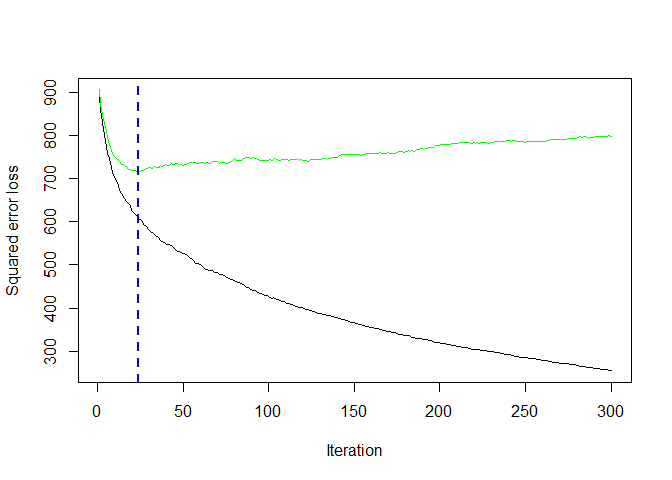
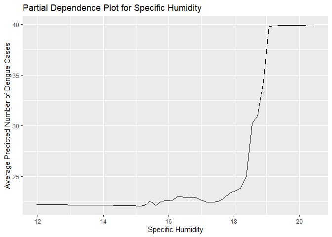
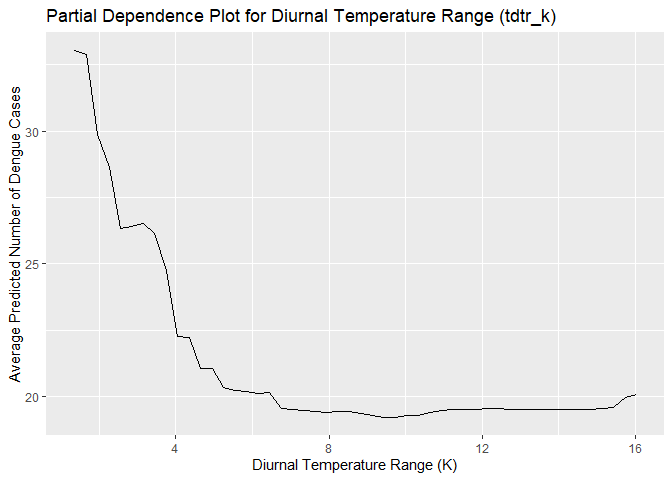
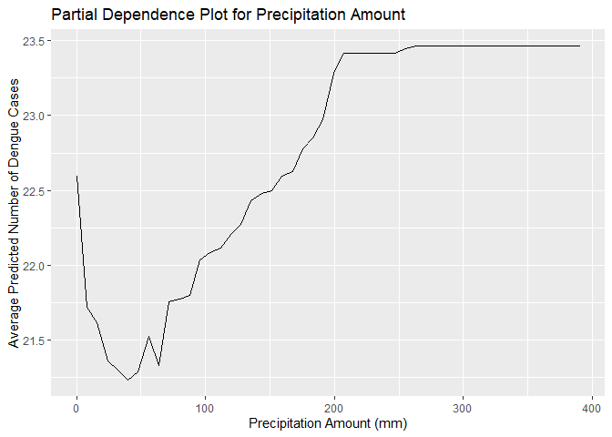
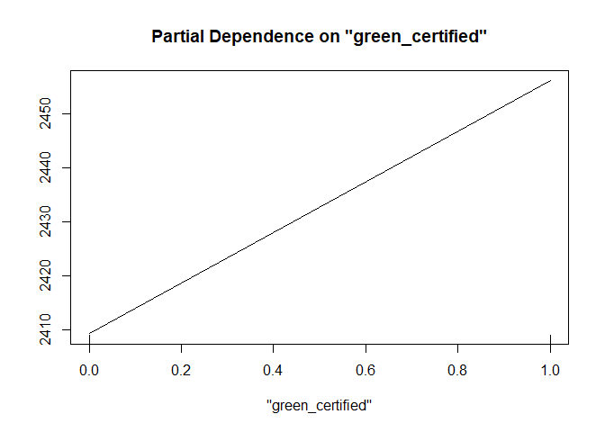
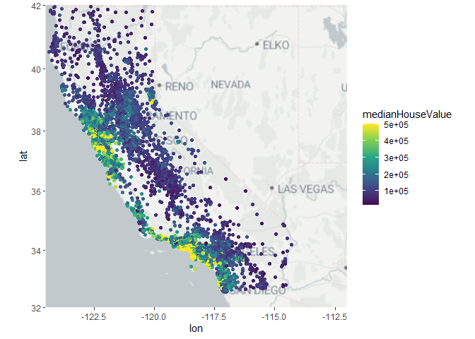
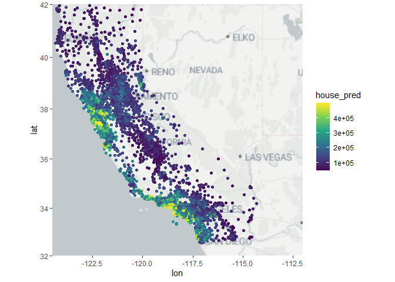
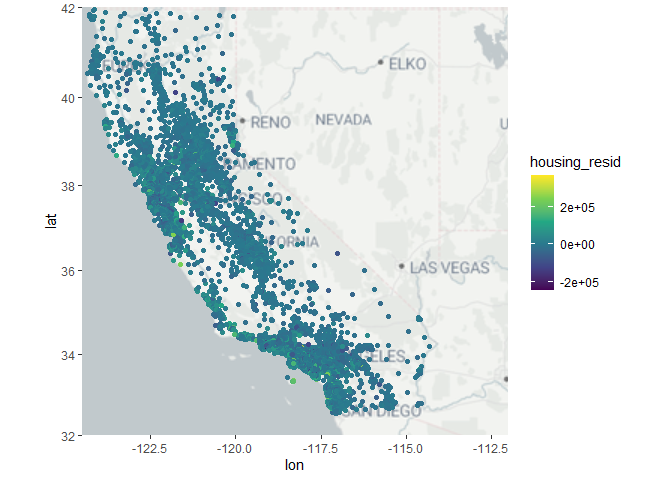

# Question 1: What Causes

## Part 1

You cannot just regress “Crime” on “Police” to understand the impact of
more cops in the street on crime due to the fact that cities with more
crime are likely to have more police officers.Because this unobserved
3rd variable exists, regressing crime on police will not produce an
accurate measure of the effect of the number of police officers on the
crime rate.

## Part 2

To isolate the effect of the number of police officers on crime, the
researchers regressed crime on a dummy variable indicating when
Washington DC was on a “high” terror alert. Since this alert resulted in
a heightened police presence but is not influenced by street crime, it
could act as instrumental variable to estimate the causal effect of
heightened police presence on crime. As can be seen in the table, days
on High Alert saw on average 7.136 less daily crimes, an effect that is
statistically significant at the 5% level.

## Part 3

The authors controlled for Metro ridership to control for if tourists
were less likely to visit Washington DC or be out in the city when it
was high terror alert. The control is attempting to capture any
reduction in daily crime that would have resulted from less tourists
being in the city who could be potential victims.

## Part 4

The model estimates the effect of an interaction between being on high
alert and in Washington DC District 1 (the district containing the
National Mall), an interaction between high alert and being in the other
police districts, and the log of midday ridership on the DC Metro on
daily crime rates. It is estimating the difference between the decrease
in daily crime rates in the District containing the National Mall (which
sees a greater increases in police presence) compared to other
districts, controlling for people travelling around the city. As can be
seen, District 1 has a decreases of -2.62 average daily crime rates when
high alert is declared, while no statistically significant effect is
estimated in the other districts.

# Question 2

    ## CV: 1 
    ## CV: 2 
    ## CV: 3 
    ## CV: 4 
    ## CV: 5

The GBM model’s performance plot reveals how it learns over time, with
the training error steadily decreasing, reflecting a good fit on
training data. The validation error’s dip and subsequent plateau suggest
an optimal number of trees at the dashed line, beyond which the model
may start to overfit.

    ## RMSE for Pruned CART Model:  28.40046

    ## RMSE for Random Forest Model:  23.6676

    ## RMSE for GBM Model:  25.93292

The Random Forest model outperforms its counterparts with an RMSE of
23.67, making it the most accurate for predicting dengue cases in this
dataset, while the CART and GBM models show higher errors, at 28.40 and
25.93 respectively.

The Partial Dependence Plots suggest that higher specific humidity may
increase dengue cases, while diurnal temperature range shows a possible
decrease in cases with greater fluctuations. Precipitation amount,
however, doesn’t show a clear impact, indicating that other factors
might be at play or that its relationship to dengue cases isn’t
straightforward. These insights can help focus preventive measures on
more impactful environmental factors.

# Question 3

## Introduction

Using a comprehensive dataset on 7,894 commercial rental propertes from
across the United States, we will first build the best predictive model
possible for revenue per square foot per calendar year. Using this model
we will quantify the average change in rental income per square foot
associated with green certification, combining both LEED and EnergyStar
as a single “green certified” category for simplicity.

## Data Preparation

Before building the model, we begin by preparing the dataset. Three key
adjustments: Defining the revenue per square foot variable as the
product of Rent and Leasing Rate, defining a single “green certified”
variable that is equal to one if the building is either LEED or
EnergyStar certified, and splitting the data into training and testing
sets.

## Model Construction

In the model construction phase, we established two models: a
comprehensive baseline model using linear regression and a random forest
model both aimed at predicting the revenue per square foot
(revenue\_psqft). The baseline linear model serves as a reference point
against which we can evaluate the relative performance of the random
forest model.

For the baseline linear regression model, we included relevant
predictors and introduced an interaction term between market rent and
size. In contrast, the random forest model was trained with a subset of
predictors selected based on their importance in predicting revenue per
square foot. Our random forest model construction utilized variable
importance metrics to identify influential predictors.

By comparing the performance metrics of the random forest model against
the baseline linear regression model, we can assess the effectiveness of
using a more sophisticated method for predicting rental revenue per
square foot.

    ## 
    ## Call:
    ## lm(formula = revenue_psqft ~ size + size * City_Market_Rent + 
    ##     age + leasing_rate + class_a + class_b + amenities + total_dd_07 + 
    ##     Gas_Costs + Electricity_Costs + green_certified, data = train_set)
    ## 
    ## Residuals:
    ##     Min      1Q  Median      3Q     Max 
    ## -5634.3  -332.1   -56.0   218.0 14781.0 
    ## 
    ## Coefficients:
    ##                         Estimate Std. Error t value Pr(>|t|)    
    ## (Intercept)           -2.018e+03  1.042e+02 -19.360  < 2e-16 ***
    ## size                  -1.393e-03  8.807e-05 -15.814  < 2e-16 ***
    ## City_Market_Rent       7.126e+01  1.466e+00  48.605  < 2e-16 ***
    ## age                   -6.641e-01  4.122e-01  -1.611  0.10721    
    ## leasing_rate           2.613e+01  5.414e-01  48.265  < 2e-16 ***
    ## class_a                2.268e+02  4.379e+01   5.178 2.31e-07 ***
    ## class_b                1.008e+02  3.489e+01   2.891  0.00386 ** 
    ## amenities              5.401e+01  2.535e+01   2.130  0.03318 *  
    ## total_dd_07            1.734e-02  8.877e-03   1.954  0.05076 .  
    ## Gas_Costs             -2.339e+04  5.362e+03  -4.361 1.31e-05 ***
    ## Electricity_Costs      7.133e+03  2.215e+03   3.221  0.00128 ** 
    ## green_certified        6.686e+01  4.083e+01   1.637  0.10163    
    ## size:City_Market_Rent  7.129e-05  2.674e-06  26.659  < 2e-16 ***
    ## ---
    ## Signif. codes:  0 '***' 0.001 '**' 0.01 '*' 0.05 '.' 0.1 ' ' 1
    ## 
    ## Residual standard error: 861.8 on 6243 degrees of freedom
    ## Multiple R-squared:  0.6986, Adjusted R-squared:  0.698 
    ## F-statistic:  1206 on 12 and 6243 DF,  p-value: < 2.2e-16

    ## 
    ## Call:
    ##  randomForest(formula = revenue_psqft ~ size + age + leasing_rate +      stories + renovated + class_a + class_b + amenities + City_Market_Rent +      Gas_Costs + Electricity_Costs + green_certified, data = train_set,      importance = TRUE) 
    ##                Type of random forest: regression
    ##                      Number of trees: 500
    ## No. of variables tried at each split: 4
    ## 
    ##           Mean of squared residuals: 334751.1
    ##                     % Var explained: 86.38

## Model Evaluation

    ## Linear Model RMSE: 899.777

    ## Random Forest RMSE: 670.1211

In the model evaluation phase, we compare the predictive performance of
the baseline linear regression model and the random forest model on the
testing dataset. The random forest model achieved a lower RMSE than the
linear regression model. This indicates that the average deviation
between the predictions of the actual revenue per square foot is
significantly lower for the random forest model, thus the random forest
model displays superior predictive accuracy compared to the baseline
model. The random forest model also explains about 86% of the variation
in revenue per square foot, a signficant improvement over the R-Squared
value for the linear model, further evidencing it’s enhanced
performance.

By leveraging a set of decision trees, the random forest model can
better adapt to the complexities inherent in the data, resulting in more
accurate predictions of rental revenue per square foot. Therefore, the
random forest model emerges as the preferred choice for its predictive
accuracy and we will use it to determine the average change in rental
income associated with green certification.

## Quantifying the Average Change in Revenue Per Square Foot Associated With Green Certification

    ## Average Change in Rental Income Per Square Foot Associated With Green Certification: 300.9668

## Conclusion

Our objective was to predict revenue per square foot for commercial
rental properties and to quantify the financial impact of green
certification. Data preprocessing was conducted, and the dataset was
split into training and testing subsets. We developed predictive models
using linear regression and random forest techniques, with the random
forest model outperforming its linear regression counterpart in terms of
predictive accuracy. We used the random forest model to determine that a
building with a green certification is estimated to generate about $300
in additional annual revenue per square foot. However, the partial
dependence plot revealed a positive but modest relationship when the
effects of other variables are controlled, indicating that green
certification has a positive, albeit smaller than initially estimated,
isolated impact on predicted annual revenue per square foot. This
nuanced finding suggests that while green certification is beneficial,
the magnitude of its isolated effect on revenue per square foot is not
as substantial when considered in the context of other contributing
factors.

# Question 4

To predict median House Value with the features provided, we decided to
use a random forest model, specifically using the randomForest function
in R. Both totalRooms and totalBedrooms listed the number of bedrooms
and rooms for the census track, which could be problematic. To adjust
this, Total Rooms and Total Bedrooms were standardized by census tract
population, dividing both values by the population of their census
tract. The resulting variables were stand\_bedrooms and stand\_rooms,
which measure bedrooms and rooms by track populations. Apart from these
modifications, we used all other columns in the data as is. Since the
number of variables was small (only 8), we did not use PCA to simplify
the data before finding the tree. Further, as we used the random forest
model, cross validation was not necessary.After running the randomForest
model on the training data, we tested its out of sample accuracy to
estimate the following RMSE as a measure of out of sample accuracy.

    ## [1] 50533.37

Next we are going to plot the actual median house values, the predicted
median house values and the residuals of the model’s predictions

As can be seen in this 3 graphs, the model appears to do a decent job of
predicting the median value of houses in a census tract. The model
appears to slightly underestimate median house value compared to the
actual median house value, but makes relatively close predictions on
average, as can be seen with the residual dots that are mostly around
dark green, light blue color.
